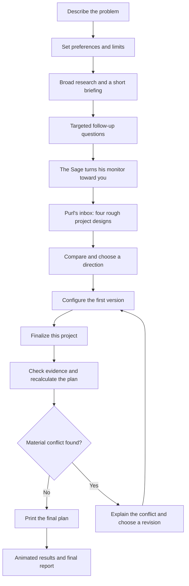

# Workflow and interaction redesign proposal

Date: 2026-09-13

Status: Approved through the user-submitted goal on 2026-09-13. Implemented; acceptance and deployment recorded in WORKFLOW-IMPLEMENTATION-STATUS.md.

Basis: User's screen-by-screen feedback, attached assignment, and current source review.

## 1. Decisions already made

- Address the entire reported workflow, including controls, character transitions, affected eras, concept editing, finalization, and results.
- Keep the Sage, RPG presentation, internet history setting, and Purl.
- Keep exactly four initial concepts: three within the prototype budget and a clearly marked fourth that exceeds it.
- Initial concepts should be useful enough to choose a direction. Develop the selected concept into the final plan as the completion of the experience.
- Replace the repetitive running-cat treatment with varied sourced media.
- Finish and discuss this proposal before implementation. This is the user's explicit instruction on 2026-09-13.

The user approved this direction through the submitted goal. The existing PRDs remain historical context; this proposal supersedes their conflicting requirements for fixed dialogue forms, paginated answers, separate finalization confirmations, and concept attachment locks.

## 2. Proposed journey

Keep the user's next action obvious at every stop. Research and generation can contain a performance, but completion of a task should not require navigating a second representation of the same result.

### Layout and navigation

Use two related layouts. Short questions retain the portrait, dialogue, and answers in one RPG frame. Writing, tags, comparison, feature editing, and reports receive a larger opaque work panel, with the Sage's short guidance attached to it. The frame reserves its space before typing begins.

Early panels feel like a quest journal. The concept reveal introduces the computer desktop, which then carries comparison, editing, and finalization. Use a compact journal control to revisit completed decisions without replaying the scene. A change to an earlier decision identifies affected results before replacing them.

The interface must carry the same pixel treatment as the world while giving sentences, fields, and labels adequate space. Body text must remain readable at the smallest supported desktop size.

### Visual correction from the user's review, 2026-09-13

The user identified drift across most of the redesign and clarified that Webfishing's almost-pixel style is what sells the aesthetic. This applies to the whole experience, not only the Sage, cursor, or a few headings. A softer palette alone does not address the feedback.

- Preserve the cute, crunchy low-poly world and character. Use consistent visible pixel scale, crisp silhouettes, restrained textures, and authored pixel assets. Avoid smooth high-resolution props competing with the coarse character.
- Make the journal, inputs, tags, meters, inbox, feature editor, and results belong to that world. Use deliberate pixel geometry, hard-edged borders and shadows, bitmap-style interface lettering, and clear game-like selection states. Do not recreate conventional web forms and add a pixel heading.
- Keep longer text and editable fields comfortably readable. Choose type size and spacing deliberately; do not shrink or blur the whole interface to simulate low resolution. Preserve accessible HTML controls and selectable text.
- Keep each internet era recognizable, including the later social feeds, while matching its framing and dimensional props to the scene's pixel treatment. Era-specific media can retain its original appearance.
- Establish the correction on the problem-entry screen and Purl's desktop first, with browser-visible before/after evidence. These represent both main layouts. Carry the same treatment through the remaining workflow before calling the visual pass complete.

This clarifies the existing presentation direction in `PRESENTATION-RECOVERY-PRD.md` and `INTERNET-HISTORY-DESIGN.md`. It does not change the approved workflow or count as an implemented visual correction.

## 3. Input and interview design

### W-01: Opening and problem entry

Merge the confusing first selector and problem entry into one clear opening task. The main action opens the problem editor directly; examples and adding another related problem are secondary actions. Nickname and project name remain optional.

Show one generous text field asking what happens, who is affected, and why it matters. Related problems appear as a visible, editable list in the same panel, with add, edit, remove, and reorder actions. Users should not have to open a scroll to understand what they already entered.

The Sage's initial understanding pass updates a small reading indicator and suggested tags. Updating the indicator, adding a problem, or typing must not restart the spoken prompt, remove the form, or steal focus. An unclear description prompts a useful follow-up later rather than blocking progress.

### W-02: Technology and research tags

Use the same themed tag picker for preferred technologies and industries/research topics:

- A visible label and a text field with keyboard-navigable autocomplete.
- Selected chips with a small, separately clickable x and an accessible removal name.
- Suggested chips below the field, visibly distinct from choices the user has confirmed.
- Suggestions informed by the problem understanding pass, plus local autocomplete while typing.
- Custom tags accepted, duplicates merged, and dismissed suggestions kept dismissed.
- An explicit "Open to suggestions" choice so beginners are not forced to name a stack.

Recommend suggesting technologies for acceptance rather than silently choosing them. Research topics inferred from the problem can be preselected and marked as suggested. The user can remove either kind.

Distinguish preferred technology from explicit exclusions. A removed preference stops being preferred; removal alone does not mean the technology is forbidden. A small "Avoid these technologies" control records actual exclusions. All four concepts honor those exclusions.

The current understanding response only returns industry suggestions. Technology suggestions require a deliberate extension to its structured output and saved state; adding a styled dropdown alone will not satisfy this requirement. Avoid an additional model request for every autocomplete keystroke.

### W-03: Originality and budget

Originality becomes a five-position pixel meter with a clear selected position and plain descriptions. For example, the ends can read "Proven approach" and "Strange but buildable." It controls the approach, not permission to ignore constraints.

Prototype budget gets a segmented pixel bar with a draggable marker, presets, and an exact USD field. All inputs stay synchronized. Increasing the amount moves through coins, sparks, and an animated flame at the high end. This is a playful scale, not a claim that spending more makes the idea better. Exact amounts remain readable and editable, including zero and values beyond the visible slider range.

Production planning uses a themed native checkbox. Enabling it reveals its own clearly labeled budget control. Deadline, team size, skills, and other practical limits are available together in a compact optional section rather than another chain of dialogue screens.

Before research, keep a brief summary in this panel and use one primary action: "Research these problems." Do not add another screen just to ask the same permission again.

### W-04: Consistent response feedback and cursor

Use a pixel wand as the normal pointer and a wizard hat over actionable controls. Keep a text caret over editable text. Cursor hotspots must match the visible point, with native fallbacks.

Every control needs discernible hover, keyboard focus, pressed, selected, disabled, and error states where applicable. Tag removal, checkboxes, and feature changes happen immediately. A submitted answer receives a short confirmed state before transition; pending requests keep that answer visible and prevent duplicate submission. Sounds support the visual feedback and respect mute.

Replace generic interception of every button click with explicit submit/selection behavior. The current dialogue component delays and replays clicks, including clicks that are not answers. It also removes and remounts response content during dialogue changes. These are investigation targets for the reported feedback and replay problems, not yet browser-confirmed root causes.

### W-05: Short adaptive interview

Recommend a short setup followed by roughly three to six substantive questions, fewer when enough is already known. Treat this as a pacing target, not a forced quota. Use additional questions only for unresolved decisions that materially affect the project; retain the option to finish early with uncertainty recorded.

Retain the current multiple-choice visual direction with touchups. All ordinary options, "I don't know," and "Type my own answer" stay on the same screen. Custom input expands within that panel. Use a stable grid or readable list instead of a four-button paginator. A long list can scroll within its own area at constrained sizes while the utility actions remain visible.

Clicking dialogue finishes the line or advances to a genuinely new line. It never replays the current prompt. When the last line ends, answers become available without a redundant extra click. Editing fields does not advance dialogue. Selecting one answer cannot accidentally activate the next question.

## 4. Research and concept performance

### W-06: Broad research and the printer

Preserve the preliminary research performance, but make ordinary typing use alternating hands with small finger/wrist movement and believable contact. A deliberate keyboard smash can be a rare, identifiable joke, not the dominant motion.

Proposed completion sequence:

1. The research completes; the monitor changes and the printer's light comes on.
2. The Sage pauses typing and looks toward the printer.
3. The rollers feed a visible sheet out of the actual printer slot, with synchronized sound.
4. He waits for the sheet to clear, reaches for it, and lifts it with continuous hand contact.
5. He turns it toward the user. The camera/view moves into that same sheet as a short research briefing.

The briefing contains a few key findings, implications for possible ideas, and open questions. Sources expand in place. The primary action is "Answer the Sage's questions." Remove "Inspect recovered files" and "Take the paper" as competing destinations. There is no additional summoned scroll behind the printed sheet.

This is a research note, visibly labeled as preliminary. The final project plan is produced later. The early paper must not imply that a finished idea already exists.

Fast, slow, failed, cancelled, and resumed research need coherent transitions. Finishing an API request does not justify snapping into a reach pose. Skipping the performance shows the same useful briefing; it does not discard research.

### W-07: Generating ideas and entering the desktop

Recommended gag: the Sage works at the computer while Purl acts as his wildly underqualified collaborator. Purl contributes a paw on the keyboard or sends a burst of messages. Three ordinary email notifications arrive. A fourth, suspicious attachment interrupts the machine, and the Sage tries to hide it before giving up.

He grips and swivels the monitor toward the user. A short camera move brings its desktop forward to occupy most of the usable screen. Once the move settles, the interactive desktop is a readable browser UI aligned with the monitor presentation, rather than tiny text rendered onto an angled 3D texture.

Purl's inbox shows all four concepts immediately. The mail metaphor stays, but opening one message must not unlock the next. Comparison is available immediately. Each message opens a consistent rough design with:

- Title, target user, problem addressed, and brief description.
- Required technologies and major components.
- Estimated cost range, development timeline, and their assumptions.
- Main challenges, unique value, and a brief explanation of fit to the user's inputs.
- Sources and explicit uncertainty where relevant.

The initial designs need enough structure to evaluate all nine assignment fields, without four full PRDs. Compare actual money ranges, time, approach, and key tradeoffs. Qualitative ratings can supplement these facts but should not replace them.

### W-08: The cursed fourth concept

Make the fourth concept feel like an infection of the fictional desktop: corrupted attachment icon, changed window chrome, a brief cascade of fake antivirus windows, a glitched wallpaper, and a shocked Sage portrait. Provide an obvious way to dismiss the gag and return to reading.

The concept's content remains readable. Label the cost range, the user's limit, and the amount over budget. Explain what the additional spending enables. The fourth concept may break the prototype budget only; it must respect explicit exclusions and other hard constraints. Its creativity should come from a distinct build approach, not random nonsense.

Keep the effect inside the fictional computer. It does not open browser windows, imitate actual OS permissions, initiate downloads, or obstruct the user's next action. Reduced motion uses the same corrupted styling with a short static reveal.

## 5. Give configuration a real job

### W-09: Configure the first version

Choosing a concept opens its project window on the same desktop. Ask "What belongs in the first version?" and start with a useful suggested build.

Each feature has three destinations: Build now, Later, or Leave out. Build now defines the prototype being finalized. Later becomes a roadmap item and is excluded from the prototype estimate. Leave out excludes it from the plan. The core behavior required to solve the chosen problem is identified, with dependencies explained when changing it.

Show the user what each decision means: the problem it addresses, required components or dependencies, and qualitative effects on scope, effort, and cost. Display the current baseline estimate. After configuration changes, mark it as awaiting recalculation instead of inventing exact dollar changes. If supported feature-level estimates become available, label their assumptions explicitly.

Provide "Restore suggested build" and a custom feature form that starts with plain language. Infer or ask about dependencies rather than making users navigate internal feature IDs. Keep per-concept drafts so comparing another direction does not erase work.

Example: moving live location tracking to Later keeps a timetable-based first version and places tracking on the roadmap. Its backend/location dependencies must leave the initial build when nothing else needs them. The final estimate reflects the actual chosen scope.

Use one primary action: "Finalize this project." A concise preview states the chosen scope and that finalization will check evidence, recalculate estimates, and produce the final plan.

## 6. Finalization and the ending

### W-10: One finalization sequence

Keep the desktop open. The selected project runs through clearly named states: checking the chosen build, updating estimates and requirements, and preparing the final plan. These stages remain visible in the same project window.

Focused research still happens, but the user does not navigate a separate research room, collect another research paper, and then request another plan. Successful focused research automatically proceeds to final-plan generation for the exact confirmed configuration.

If evidence finds a material contradiction, stop in the same window with a concrete explanation and a decision. Examples include a required component exceeding the cap or a necessary service conflicting with an exclusion. Offer a scope revision, an explicit limit change, or return to comparison. A softer concern can appear in the final plan without demanding another confirmation. Never silently discard a chosen feature to make the budget fit.

For the cursed project, the originally disclosed over-budget range is expected. A new, materially worse cost or a different hard-constraint conflict still needs attention.

Save progress across requests. A plan-generation failure retries that stage without automatically buying another completed research pass. Cancel, back, refresh, and edited configurations cannot publish a stale plan as current.

Print only when the actual final plan exists. Show its arrival with the same coherent printer mechanics, then transition into the results screen. The report opens directly from the results screen as that final document.

### W-11: Full-screen results

Use most of the screen for a lively run-complete presentation, with only the Sage's head/portrait in a corner. Give it sequential count-ups, animated rows, earned modifiers, impact sounds, a final score stamp, and a short celebration. The user should be able to reveal the total immediately.

Keep actual project information visible: selected title, final estimated budget and timeline, chosen scope, and unresolved concerns. Separate the playful run score from the evidence-based assessment of feasibility. A large animated number is not proof of engineering quality.

Provide clear "Read final plan," "Download PDF," and "Start a new run" actions. Existing leaderboard and other optional jokes stay secondary. Score service failure must not block the finished plan or PDF.

## 7. Era composition and asset variety

### W-12: Cat YouTube

Rebuild the scene around one aligned old-YouTube player. Match the player, timeline, playhead, buttons, rating stars, and related-video column to the same geometry at each viewport.

The current scene includes a webcam, rating stars, play/scrubber props, and Purl's cardboard box. Remove the box. Keep a shallow player bezel, a scrubber that belongs to the player, and rating stars that read as part of the page. Remove props that cannot be understood in the finished composition.

Prepare ten distinct cat-video entries with actual clips and matching thumbnail images, titles, and durations. Shuffle once per run, sample without replacement in the visible sidebar, and retain that order across ordinary rerenders. Thumbnail selection can show a short local clip, while the Sage's active task remains usable. Decode only the active clip; pause it when the era leaves view.

### W-13: Social feeds and doomscrolling

Recommend an Instagram-like composition for the earlier social-feed era and a TikTok-like vertical video composition for doomscrolling. The latter has recognizable full-height video cards, creator/caption text, a right-side action rail, and a small next-card preview. Use distinct sourced media instead of repeated cat GIFs.

Concentrate 3D depth in the screen frame, overlapping feed cards, and action controls. Replace unrelated floating objects and avoid depth that pushes important controls away from their corresponding page elements. Background feed motion pauses while the user is reading or making a decision.

### W-14: Asset variety and cursor artwork

Remove the running Kitka cat as the default filler in research, concept delivery, chaos overlays, and reused scenes. Give Purl distinct context-specific actions, such as sitting, peeking, pawing, stretching, or sleeping. Ambient media and Purl's character actions use separate pools.

Use sourced stills, clips, sprites, and sound where they fit; keep provenance with the local assets. Select the final set by reviewing a contact sheet and motion previews. A quantity of files alone does not prove visible variety.

Initial source leads, inspected as source pages only on 2026-09-13:

- [Liz Cheong's Pixel UI](https://lizcheong.itch.io/pixel-ui) includes an animated green flame, progress-bar sprite strips, and an Aseprite file. This is a candidate for the budget animation, not yet integrated or visually approved.
- [Otsoga's Dynamic Status Bars](https://otsoga.itch.io/dynamic-status-bars) is another reference candidate for meter treatment.
- [Wikimedia Commons cat videos](https://commons.wikimedia.org/wiki/Category:Videos_of_cats) and its playing-cat category provide a pool for distinct clips and corresponding thumbnails. The ten-item selection remains implementation work.

## 8. Rubric coverage and verification

The assignment is an evaluation reference, not an instruction to fill out the submitted worksheet during this design session.

| Assignment concern                                              | Proposed behavior and evidence                                                                                                                                                                                     |
| --------------------------------------------------------------- | ------------------------------------------------------------------------------------------------------------------------------------------------------------------------------------------------------------------ |
| At least eight testable requirements                            | Convert the approved W requirements into individual shall statements and verification methods.                                                                                                                     |
| Three dynamic inputs, two constraints, optional text            | Technology/topics/originality inputs; explicit budget/deadline or exclusions; optional context, each with defined validation.                                                                                      |
| At least three consistently organized ideas                     | Four complete rough designs using the same nine output fields.                                                                                                                                                     |
| Constraints followed                                            | Verify the three ordinary ideas against budget and every hard constraint. Test the fourth as an explicitly labeled budget exception.                                                                               |
| The worksheet's sample test says every idea stays within budget | Preserve this discrepancy explicitly. If that sample wording is mandatory for grading, the current desired fourth option conflicts with it and needs instructor clarification. Do not report that test as passing. |
| Truthful, useful output                                         | Cost/timeline assumptions, sources, uncertainty, and explicit links to user needs.                                                                                                                                 |
| Error handling and key security                                 | Keep server-side credentials and input validation; verify missing/invalid input, API failure, partial research, and retry behavior.                                                                                |
| Deficiency, revision, retest                                    | Capture the current failure before replacement, then compare the same interaction and inputs after implementation.                                                                                                 |
| Three selected viable projects in the submission                | Use the three ordinary rough designs as candidates for assessment. Their viability needs evidence; generating three is not itself proof. The app still ends with one finalized plan.                               |

Proposed implementation order after agreement:

1. Capture current failures, then establish shared RPG panels, controls, cursor, and explicit dialogue/answer states. Verify one complete problem-to-interview slice.
2. Add tag suggestions, budget/originality controls, and compact setup. Verify removal, typing, keyboard use, and validation.
3. Repair typing, printer feed, and the preliminary briefing transition with real-time recordings.
4. Build monitor-turn choreography, desktop mail, comparison, and the cursed fourth reveal.
5. Replace feature toggles with first-version configuration, then join focused checking and final-plan generation.
6. Repair YouTube/social-feed composition, integrate the varied asset set, and build the animated results screen.
7. Verify the complete workflow with a token-free run and a bounded real-model run once authorized, including report/PDF consistency and relevant failure cases.

For UI work, inspect fresh browser runs at 1024x768, 1440x900, and 1920x1080, plus a narrow functional fallback. Record timing-sensitive sequences at real speed: clicking/typing, selecting answers, printing, monitor rotation, virus reveal, and results. Check console/resource errors and whether required controls remain visible. Keep a record of implemented, visually verified, and deployed status separately.

Use focused tests for consequential logic: suggestion dismissal, exclusions and budgets, feature dependencies and deferred scope, stale result invalidation, finalization retry, and required output fields. Do not manufacture grading evidence from canned outputs or claim passing tests before executing them.

## 9. Decisions to settle

The main product decision is whether Build now / Later / Leave out makes feature editing useful enough, or whether the user would prefer guided scope questions with fewer manual controls. Recommend the three destinations with a good starting configuration.

The main presentation decision is the sustained desktop after the monitor turns. Recommend keeping comparison, configuration, and finalization there, then leaving it for the large results screen.

The remaining paper decision is the preliminary research note. Recommend keeping its physical print animation, opening that same note as the brief, and reserving the next print for the actual completed project plan. No focused-research paper in between.

No application code, media assets, model prompts, or deployment were changed while preparing this proposal. Source observations explain likely failure paths; new browser evidence is required before naming confirmed visual root causes.
